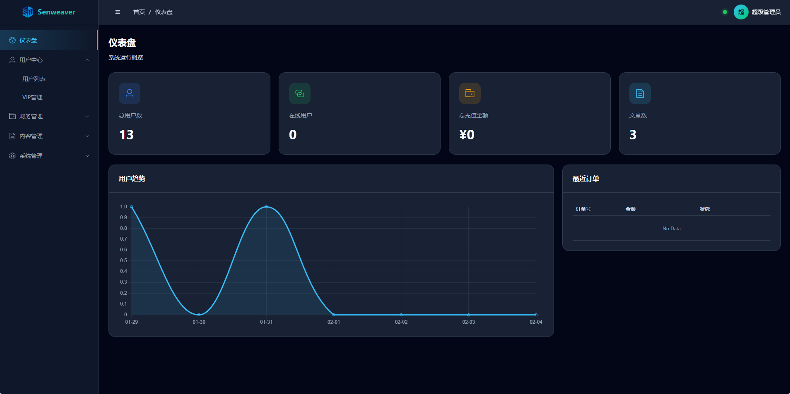
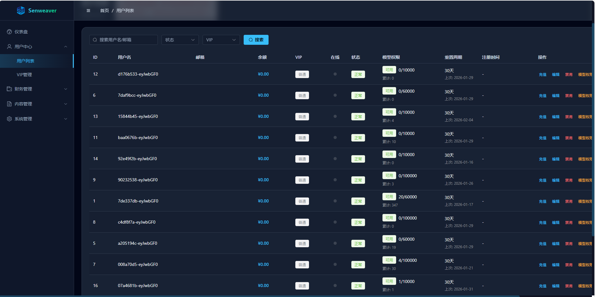
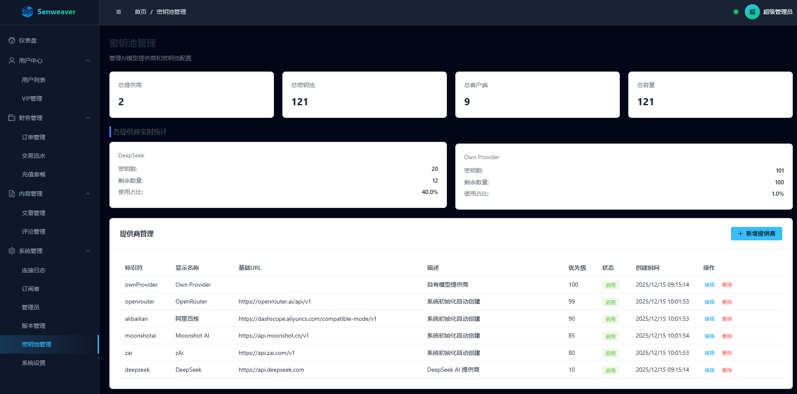
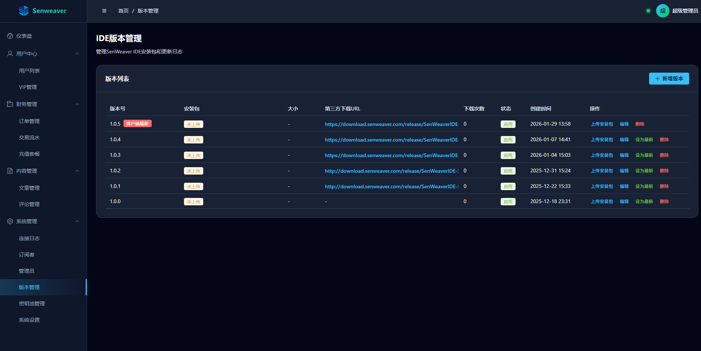

# 🚀 SenWeaver IDE 管理系统

<p align="center">
  
</p>

<p align="center">
  <strong>基于 FastAPI + Vue.js 的现代化 IDE 资源管理和分配平台</strong>
</p>

<p align="center">
  <a href="#-功能特性">功能特性</a> •
  <a href="#-技术架构">技术架构</a> •
  <a href="#-快速开始">快速开始</a> •
  <a href="#-项目截图">项目截图</a> •
  <a href="#-开源协议">开源协议</a>
</p>

---

## ✨ 功能特性

### 🔐 完整的用户管理体系
- 用户注册、登录、权限管理
- 用户状态管理（活跃/禁用/删除）
- VIP 会员系统和充值管理
- 模型调用配额管理
- 实时在线用户查看（WebSocket）

### 💰 订单与交易系统
- 订单创建、查询、状态跟踪（待支付/已支付/已退款）
- 充值套餐管理
- 交易记录查询（充值/消费/退款/赠送/调整）
- 用户余额管理

### 🔑 智能密钥池管理
- 多提供商密钥池支持（DeepSeek、OpenRouter、阿里百炼、Zai、Moonshot AI 等）
- 动态密钥分配和回收
- 并发控制和用量统计
- 密钥池健康状态监控
- 密钥分配记录追踪

### 📡 WebSocket 实时通信
- 客户端连接管理（支持管理员和普通用户）
- 实时在线用户统计
- 自动心跳包机制（每60秒）
- 多端登录互斥控制
- 客户端密钥自动分配
- 版本更新自动推送

### 📝 文章与内容管理
- 文章发布、编辑、审核、删除
- 文章分类管理
- 评论系统（审核机制）
- 邮件订阅功能
- 文章浏览量和点赞统计

### 📊 数据统计与分析
- 仪表盘数据可视化（用户数、在线数、收入、文章数）
- 用户增长趋势分析（7天图表）
- 订单统计报表
- 连接日志记录（连接/断开）
- 交易记录统计

### 🔄 IDE 版本管理
- IDE 版本发布管理
- 自动更新检测和推送
- 版本文件下载服务
- 更新日志管理
- 最新版本标记

### 👤 管理员系统
- 管理员登录认证（Token + Session）
- 多管理员支持（超级管理员/普通管理员）
- 管理员权限控制
- 密码修改功能

---

### 🔮 即将开源
我们正在准备开源以下专有模型：
- **代码补全模型** - 智能代码补全引擎，支持多语言上下文感知与语义预测，让代码编写如行云流水
- **任务规划模型** - 企业级智能任务规划与调度系统，专为高并发高效精准场景优化，实现毫秒级的需求解析与任务规划、调度，重新定义开发效率

敬请期待！

---

## 🏗️ 技术架构

**后端**: FastAPI + SQLAlchemy + PostgreSQL + WebSockets

**前端**: Vue.js 3 + Vite + Element Plus + Pinia

---

## 📁 项目结构

```
senweaver_ide_web/
├── backend/                      # 后端服务 (FastAPI)
│   ├── main.py                   # 应用入口
│   ├── init_db.py                # 数据库初始化
│   ├── requirements.txt          # 依赖列表
│   ├── .env.example              # 环境变量示例
│   └── src/                      # 源代码
│       ├── api/                  # API 路由
│       ├── core/                 # 核心配置
│       ├── models/               # 数据模型
│       ├── schemas/              # 数据模式
│       ├── services/             # 业务逻辑
│       └── utils/                # 工具函数
│
├── frontend/                     # 前端应用 (Vue.js)
│   ├── package.json              # 依赖配置
│   ├── vite.config.js            # Vite 配置
│   ├── .env.example              # 环境变量示例
│   └── src/
│       ├── api/                  # API 接口
│       ├── views/                # 页面组件
│       └── stores/               # 状态管理
│
└── resources/                    # 项目截图
```

---

## 📸 项目截图

### 📊 管理仪表盘
<p align="center">
  
</p>
仪表盘提供全局数据概览：
- 总用户数、在线人数、总收入统计
- 文章发布统计
- 最近订单动态
- 用户增长趋势图（7天）

### 👥 用户管理
<p align="center">
  
</p>
强大的用户管理功能：
- 用户列表展示和搜索
- 用户状态管理（启用/禁用）
- VIP 等级和余额管理
- 模型调用配额设置
- 实时在线状态显示（WebSocket）

### 🔑 密钥池管理
<p align="center">
  
</p>
多提供商密钥池管理：
- 提供商配置（DeepSeek、OpenRouter、阿里百炼、Zai、Moonshot AI）
- 密钥池动态分配
- 使用量统计监控
- 密钥健康状态检测
- 密钥分配记录

### 🔄 版本控制
<p align="center">
  
</p>
IDE 版本管理：
- 版本发布和更新
- 更新日志管理
- 客户端自动更新推送

---

## 🚀 快速开始

### 环境要求
- **Python**: 3.8+
- **Node.js**: 16+
- **PostgreSQL**: 12+

### 1. 克隆项目

```bash
git clone https://github.com/senweaver/senweaver-ide-admin.git
cd senweaver-ide-admin
```

### 2. 后端部署

#### 安装依赖
```bash
cd backend
pip install -r requirements.txt
```

#### 配置环境变量
```bash
cp .env.example .env
# 编辑 .env 文件，配置数据库等信息
```

**backend/.env 示例：**
```env
# 数据库配置
DB_HOST=localhost
DB_PORT=5432
DB_USER=your_db_user
DB_PASSWORD=your_db_password
DB_NAME=senweaver_ide

# 调试模式
DEBUG=false

# 阿里云OSS配置（可选，用于图片存储）
ALIYUN_OSS_ACCESS_KEY_ID=your_access_key_id
ALIYUN_OSS_ACCESS_KEY_SECRET=your_access_key_secret
ALIYUN_OSS_BUCKET=your_bucket_name
ALIYUN_OSS_PREFIX=your_prefix
ALIYUN_OSS_ENDPOINT=https://oss-cn-region.aliyuncs.com
ALIYUN_OSS_PUBLIC_ENDPOINT=https://oss-cn-region.aliyuncs.com
ALIYUN_OSS_SIGN_EXPIRES=3600

# IDE归属认证密钥（用于客户端连接认证、心跳认证、联网搜索认证）
AUTH_SALT=your_auth_salt

# 默认管理员配置（首次启动时自动创建）
DEFAULT_ADMIN_USERNAME=admin
DEFAULT_ADMIN_PASSWORD=your_secure_password
DEFAULT_ADMIN_NAME=超级管理员
```

#### 初始化数据库
```bash
python init_db.py
```

#### 启动服务
```bash
# 方式1：直接运行
python main.py

# 方式2：使用 uvicorn
uvicorn main:app --host 0.0.0.0 --port 8000 --reload

# 方式3：Windows
start.bat

# 方式4：Linux/Mac
./start.sh
```

后端服务默认运行在 http://localhost:8000

**API 文档地址：**
- Swagger UI: http://localhost:8000/docs
- ReDoc: http://localhost:8000/redoc

### 3. 前端部署

#### 安装依赖
```bash
cd frontend
npm install
```

#### 配置环境变量
```bash
cp .env.example .env
# 编辑 .env 文件
```

**frontend/.env 示例：**
```env
# 前端环境变量配置

# API基础URL（开发环境使用）
VITE_API_BASE_URL=http://127.0.0.1:18006

# WebSocket主机地址（开发环境使用）
VITE_WS_HOST=127.0.0.1:18006

# 应用标题
VITE_APP_TITLE=SenWeaver IDE 管理系统
```

#### 启动开发服务器
```bash
npm run dev
```

前端开发服务器默认运行在 http://localhost:5174

#### 构建生产版本
```bash
npm run build
```

---

## 🔧 详细配置说明

### 密钥池配置

编辑 `backend/src/core/key_pool_config.py` 配置各提供商的 API 密钥：

```python
# 配置各提供商的API密钥
ALIBAILIAN_KEYS = [
    "sk-your-alibailian-api-key",
]

ZAI_KEYS = [
    "your-zai-api-key",
]

OPENROUTER_KEYS = [
    "sk-or-v1-your-openrouter-key",
]

DEEPSEEK_KEYS = [
    "sk-your-deepseek-api-key",
]

MOONSHOTAI_KEYS = [
    "sk-your-moonshot-key",
]

OWNPROVIDER_KEYS = [
    "sk-your-own-provider-key",
]
```

### WebSocket 配置

前端 WebSocket 连接地址可通过环境变量配置：
```env
VITE_WS_HOST=127.0.0.1:8000
```

或者在代码中修改 `frontend/src/views/users/UserList.vue`。

---

## 🐳 Docker 部署

### 后端 Docker 部署
```bash
cd backend
docker build -t senweaver-ide-backend .
docker run -d -p 8000:8000 \
  -e DB_HOST=your_db_host \
  -e DB_PASSWORD=your_password \
  -e AUTH_SALT=your_auth_salt \
  senweaver-ide-backend
```

### Docker Compose（推荐）
```yaml
version: '3.8'
services:
  db:
    image: postgres:15
    environment:
      POSTGRES_USER: postgres
      POSTGRES_PASSWORD: your_password
      POSTGRES_DB: senweaver_ide
    volumes:
      - postgres_data:/var/lib/postgresql/data
    ports:
      - "5432:5432"
  
  backend:
    build: ./backend
    ports:
      - "8000:8000"
    env_file:
      - ./backend/.env
    depends_on:
      - db
  
  frontend:
    build: ./frontend
    ports:
      - "80:80"
    depends_on:
      - backend

volumes:
  postgres_data:
```

---

## 💡 使用场景

SenWeaver IDE 管理系统适用于以下场景：

- **AI IDE 平台**: 管理用户订阅和密钥分配，提供多租户服务
- **企业内部**: 统一管理开发团队的 IDE 资源和密钥配额
- **教育培训机构**: 管理学员的 IDE 使用配额和学习资源
- **开源社区**: 提供基于 WebSocket 的实时协作开发平台
- **个人开发者**: 管理自己的多个 IDE 客户端和 API 密钥

---

## 🛡️ 安全说明

### 数据安全
- 所有敏感配置均通过环境变量管理，不硬编码在代码中
- 数据库密码使用 SHA256 加密存储（用户密码）
- 管理员 Token 使用 secrets 模块生成，24小时过期
- WebSocket 连接支持心跳检测和自动重连

### 认证机制
- 管理员登录使用 Bearer Token 认证
- WebSocket 连接支持 Token 认证
- 客户端连接支持 user_id + timestamp + auth 签名验证
- IDE 归属认证使用 AUTH_SALT 签名机制

### 访问控制
- API 接口分层权限控制（管理员/普通用户）
- 用户状态管理（活跃/禁用/删除）
- VIP 等级权限控制
- 模型调用配额限制

---

## 🤝 贡献指南

欢迎所有形式的贡献！

### 提交规范
```
feat: 添加新功能
fix: 修复 bug
docs: 文档更新
style: 代码格式调整
refactor: 代码重构
test: 测试相关
chore: 构建/工具链相关
```

### 贡献流程
1. **Fork** 本仓库
2. **创建特性分支** (`git checkout -b feature/AmazingFeature`)
3. **提交更改** (`git commit -m 'feat: Add some AmazingFeature'`)
4. **推送到分支** (`git push origin feature/AmazingFeature`)
5. **开启 Pull Request**

---

## 📄 开源协议

本项目采用 **[MIT License](LICENSE)** 开源协议。

这意味着您可以：
- ✅ 商业使用
- ✅ 修改代码
- ✅ 分发
- ✅ 私人使用
- ✅ 二次开发
- ✅ 子许可

唯一的要求是：
- 📋 保留版权声明和许可证声明

详见 [LICENSE](LICENSE) 文件。

---

## 📞 联系方式

- **问题反馈**: [GitHub Issues](https://github.com/senweaver/senweaver-ide-admin/issues)
- **功能建议**: [GitHub Discussions](https://github.com/senweaver/senweaver-ide-admin/discussions)

---

<p align="center">
  <strong>Made with ❤️ by SenWeaver Team</strong>
</p>

<p align="center">
  Copyright © 2026 SenWeaver. All rights reserved.
</p>